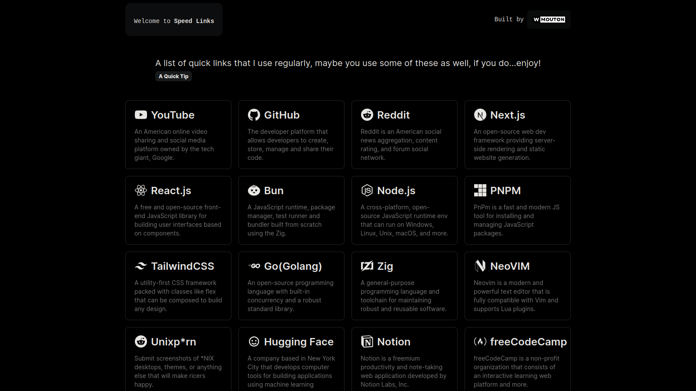

<h1 align="center">
  <br>
  <a href="http://speedlinks.vercel.app"></a>
  <br>
  Speed Links
  <br>
</h1>

<h4 align="center">A list of quick links that I use regularly, maybe you use some of these links as well, if you do... <a href="http://electron.atom.io" target="_blank">enjoy!</a></h4>
<p align="center">
  <a href="#introduction">Introduction</a> •
  <a href="#installation">Installation</a> •
  <a href="#tip">Tip</a> •
  <a href="#license">License</a>
</p>



## Introduction

Introducing Speed Links: Your Shortcut to Essential Web Resources

Hi there, welcome to Speed Links – my personal solution for streamlined web browsing. As a developer, I know the value of quick access to essential links. That's why I created Speed Links – a collection of my go-to websites, carefully curated for efficiency and convenience.

In a digital world overflowing with content, finding what you need can be a hassle. With Speed Links, I've handpicked the most useful and relevant resources, saving you time and effort. Whether it's industry insights, helpful tools, or just a bit of fun, you'll find it here.

Join me in simplifying your online experience with Speed Links. It's the shortcut you never knew you needed.

## Installation

To clone and run this application, you'll need [Git](https://git-scm.com) and [Node.js](https://nodejs.org/en/download/) (which comes with [npm](http://npmjs.com)) installed on your computer.

> **Note**:
> I use `PNPM` for most of my projects, however...I prefer `Bun` for some projects.

Install the project by following the instructions provided below... From your command line:

```bash
# Clone this repository
$ git clone https://github.com/wmouton/speedlinks

# Go into the repository
$ cd speedlinks/

# Install dependencies
$ pnpm install

# Run the app
$ pnpm run dev
```

> **Note**:
> You can also use `Bun` or `NPM`.

## Tip

> You can add `https://speedlinks.vercel.app` as your browser&apos;s default home page. This will allow you to have access to these links every time you open your browser or navigate to your home page.

## License

GPL-3.0

---
